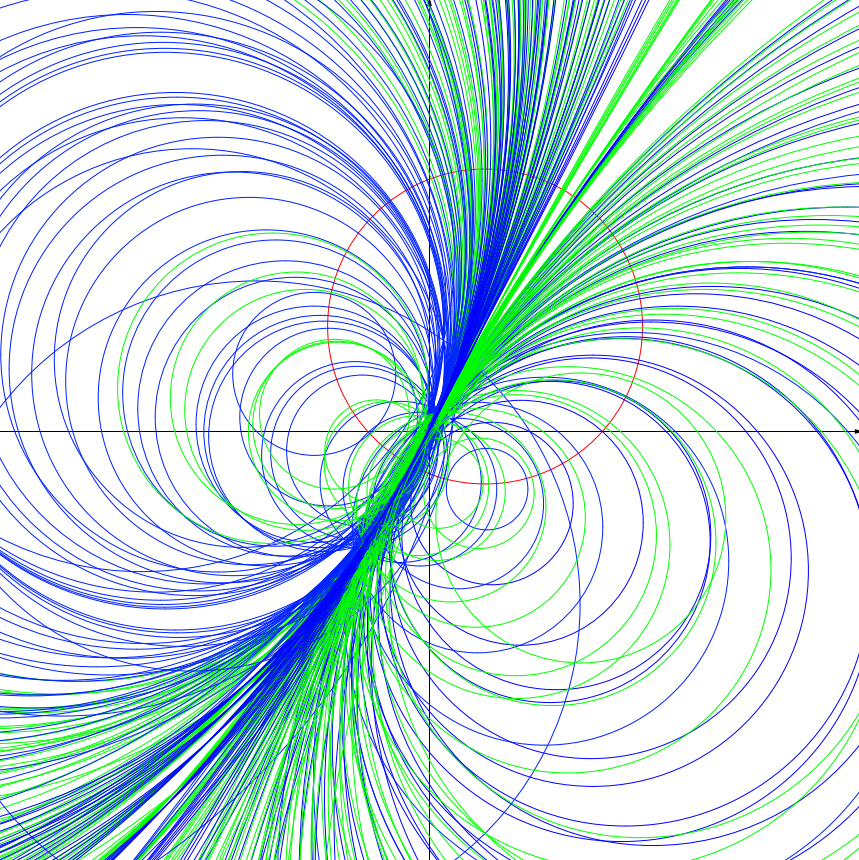
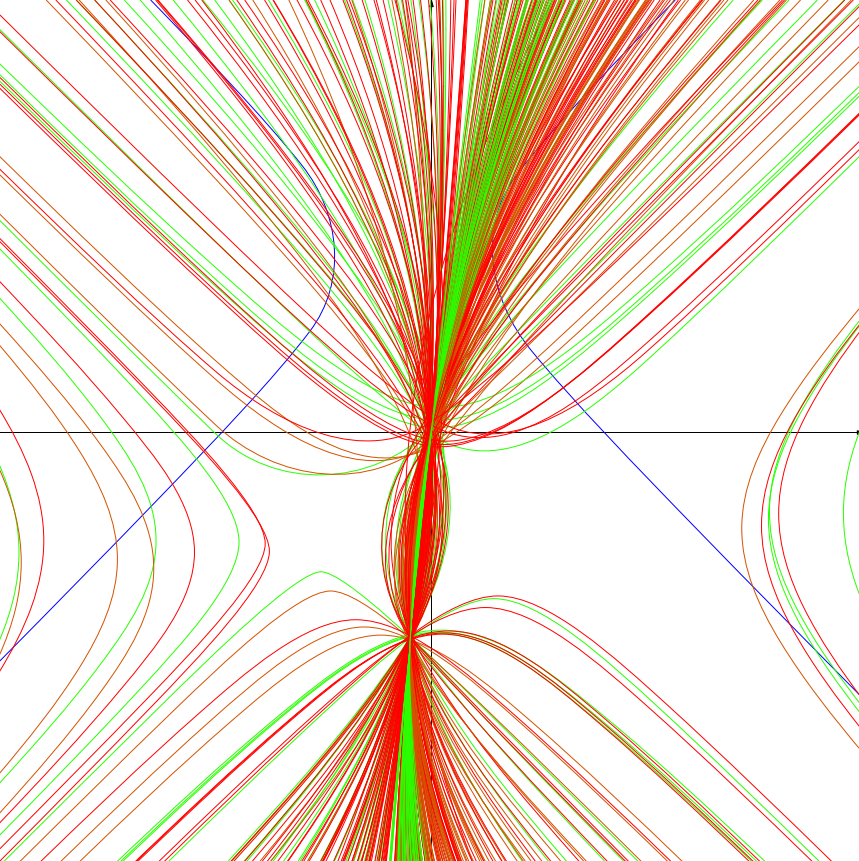
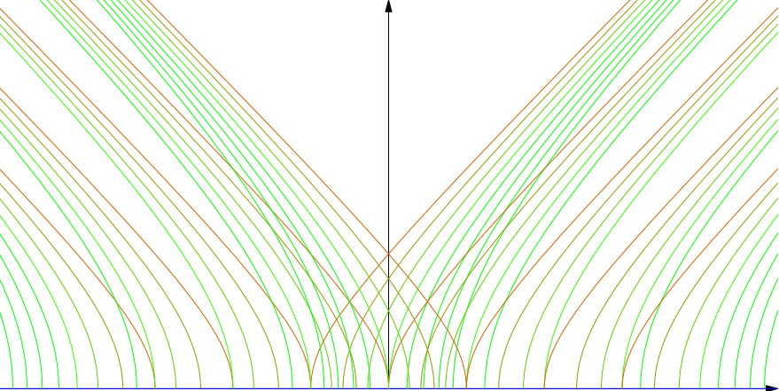

I found another couple of interesting images from my masters.

They represent cycles orthogonal to a single cycle. A cycle is a representation of all numbers equidistant from a complex or double number (numbers of the form x + yj, where j squared is one).

Here are double cycles orthogonal to the x axis.

