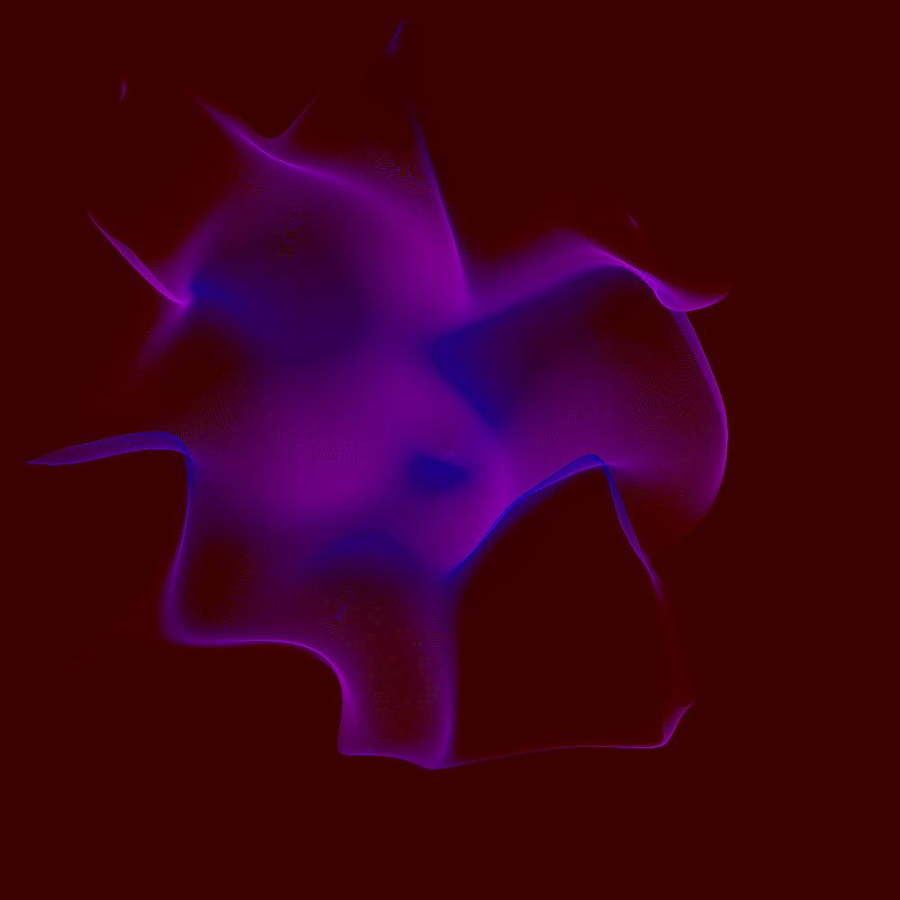
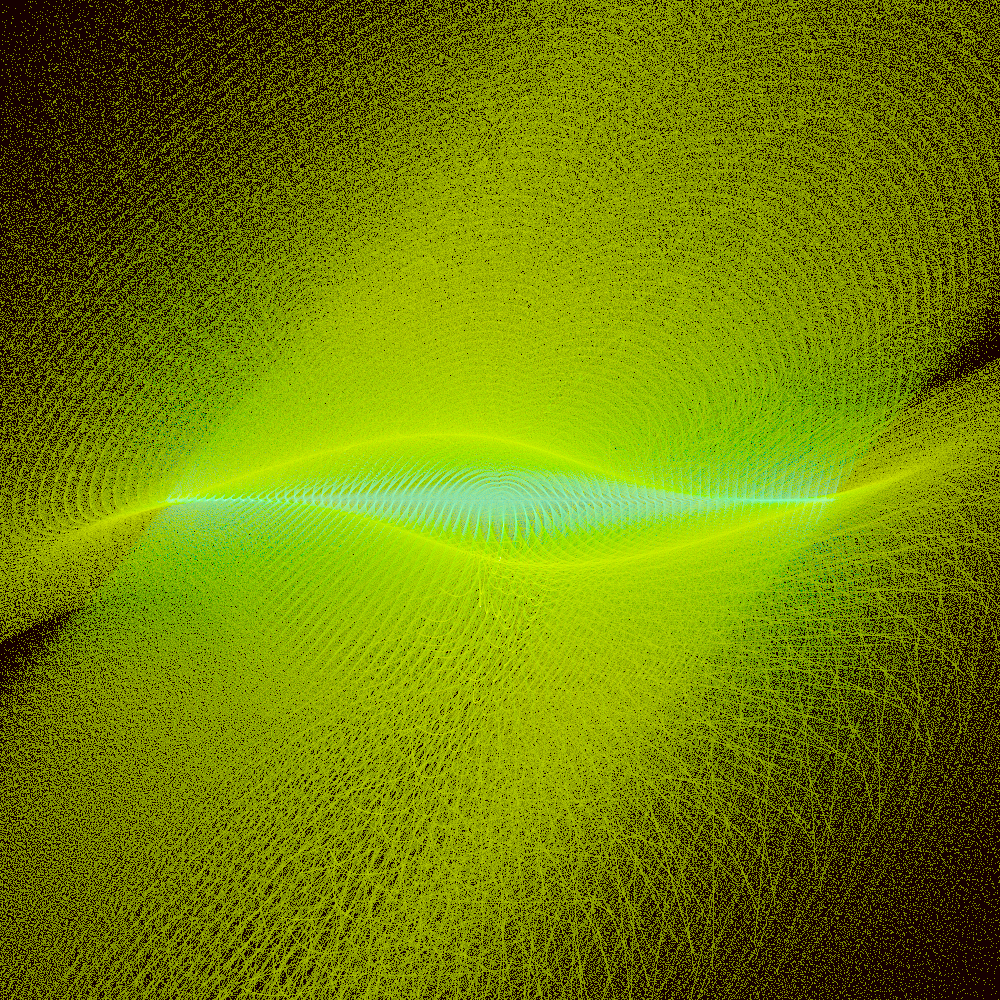
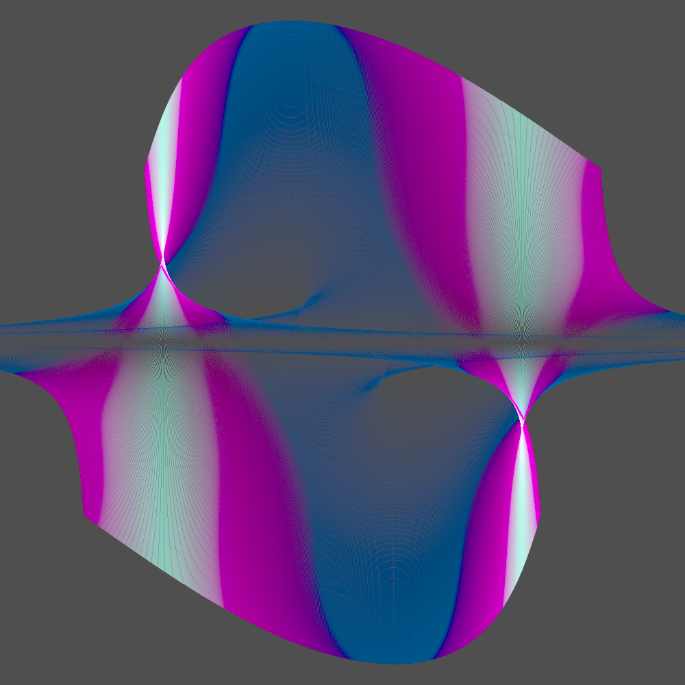

Based on [tsulej's article](https://generateme.wordpress.com/2018/10/24/smooth-rendering-log-density-mapping/), I recreated the rendering engine with [nannou](https://github.com/jacomago/log_density).


My purple version of tsulej's pictures.

Which uses the normal distribution as a random source.

```rust
fn expectation(xy: Vec2) -> f32 {
    (-xy.length().pow(2.0) / 2.0).exp()
}
```

And a mapping to color and position via:

```rust
    let r = point_param.noise_scale * xy.length();
    let t = vec2(
        (noise.get([xy.x as f64, xy.y as f64, point_param.noise_pos.x.into()]) - 0.5) as f32,
        (noise.get([
            (xy.y - 1.1) as f64,
            (xy.x + 1.1) as f64,
            point_param.noise_pos.y.into(),
        ]) - 0.5) as f32,
    );
    let nxy = r * t;
    (
        point_param.zero_point + point_param.scale * xy + nxy,
        basic_color(lerp_colors(colors, t.length())),
    )
```


Using a random distribution of

```rust
 (-xy.length().sin().pow(2.0) / 2.0).exp()
```

And a generation of

```rust

    let r = point_param.noise_scale * xy.length();
    let psi = r * xy.angle();
    let t = xy.x
        * vec2(
            (psi + point_param.noise_pos.x).cos() + (psi + point_param.noise_pos.x).sin(),
            (psi + point_param.noise_pos.y).cos() - (psi + point_param.noise_pos.y).sin(),
        );
    let nxy = r * t;
    (
        point_param.zero_point + point_param.scale * xy + nxy,
        basic_color(lerp_colors(colors, t.length())),
    )
```


Using a random distribution of

```rust
    1.0 - (-xy.length().pow(2.0) / 2.0).exp()
```

And a generation of

```rust
    let r = point_param.noise_scale * xy.length();
    let t = vec2(xy.x.sin() * xy.y.cos() as f32, xy.y.cos() / xy.x);
    let nxy = r * t;
    (
        point_param.zero_point + point_param.scale * xy + nxy,
        basic_color(lerp_colors(colors, t.length())),
    )
```

You can see it's easy to make new images by combining different transcendental functions.