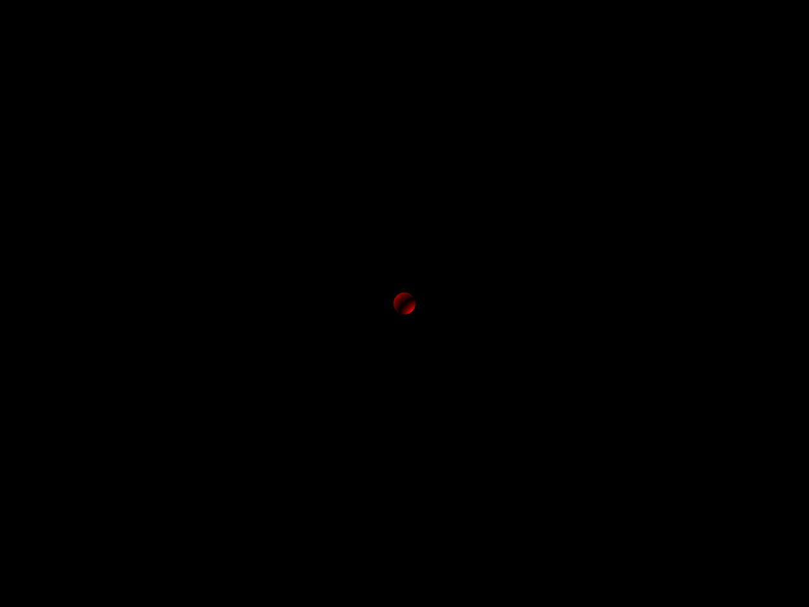

A ray tracer based on the [raytracer construction kit](https://matklad.github.io/2022/12/31/raytracer-construction-kit.html) by matklad.

I focused mostly on not relying on any third party crates with this project. Building up mini libraries for geometry, colors, image creation and then of course the ray tracer itself. I stopped at the point where it suggests to make a mini language for scene description files as I've never done anything like that before. So I decided I would go do that separately first.

## Examples

- Circle
    
- Sphere
    
- Two Spheres
    