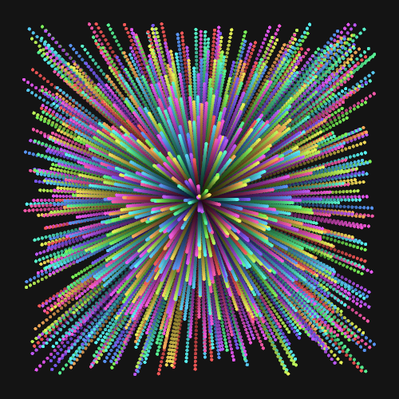
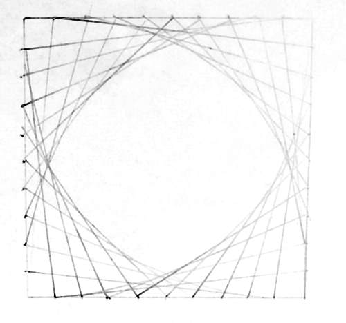
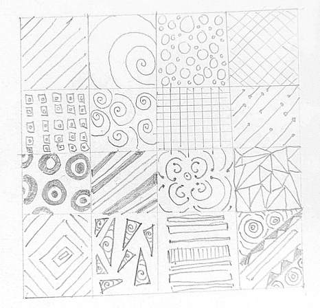
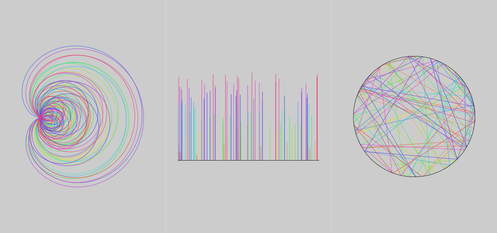

Recently I started making generative art with [nannou](http://nannou.org).

It made me think about when I first got interested. I can remember as a child in Primary school - 5- 11 year old - being tasked to make diagrams like this:

I can also remember in Year three - age eight - in art class and being given the proejct of filling an A4 page of square boxes with different patterns and being one of the few in the class to have finished the project.

Doing it again now, I can see the appeal. There is something quite meditative about doing it. You have to think quite hard to avoid repeating ideas, but you're still only thinking about simple things.

As I got older I still enjoy the process, although now with code. During my PhD in number theory, I made some posters with the Reimann zeta function.

The first image is a plot of the Reimann zeta function along the half line for the first 100 zeroes. I imagine some people might recognise it. The second image is the fractional part of the imaginary part of the zeroes mapped to the unit circle. For my thesis I studied the the fractional part of the zeroes, which are uniformly distributed just like uniform random numbers. Hence you can use the fractional parts of the zeroes as a random number source. The third image is again a plot of the fractional part of the zeroes using the imaginary part as the height.

Generally I think they just look cool!
